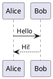

<div align="center">

# Monolog

**개발자를 위한 모던 티스토리 블로그 스킨**

다크모드 | PlantUML | 코드 하이라이팅 | 키보드 단축키 | 읽기 위치 기억

[](LICENSE)
[](https://www.tistory.com)

</div>

---

## Why Monolog?

기존 티스토리 스킨은 개발 블로그에 최적화되어 있지 않습니다. 코드 하이라이팅이 부실하고, 다크모드가 없고, 모바일 대응이 부족합니다.

**Monolog**는 개발자가 개발자를 위해 만든 스킨입니다. 코드를 아름답게 보여주고, 다이어그램을 자동 렌더링하고, 키보드만으로 블로그를 탐색할 수 있습니다.

## Features

### Core

| 기능 | 설명 |
|------|------|
| **다크/라이트 모드** | OS 설정 자동 감지 + 수동 토글 + localStorage 저장. FOUC(깜빡임) 방지 |
| **코드 하이라이팅** | highlight.js 기반 자동 언어 감지. 파일명 주석(`// User.java`)으로 정확한 언어 힌트 |
| **코드 복사 버튼** | 원클릭 코드 복사. 언어 뱃지 표시 |
| **PlantUML 렌더링** | 코드블록에 작성한 PlantUML이 자동으로 SVG 다이어그램으로 변환 |
| **자동 목차(TOC)** | H2/H3 기반 목차 자동 생성 + 스크롤 스파이 하이라이팅 |
| **반응형 디자인** | 모바일 우선. 1440/1280/1024/768/480px 5단계 브레이크포인트 |

### Developer-First

다른 티스토리 스킨에서 찾기 힘든, 개발자 특화 기능들:

| 기능 | 설명 |
|------|------|
| **키보드 단축키** | `/` 검색, `d` 다크모드, `t` 목차, `j/k` 이전/다음 글, `h` 홈, `?` 도움말 |
| **헤딩 앵커 링크** | 제목에 마우스를 올리면 링크 아이콘 표시. 클릭하면 해당 섹션 URL 복사 |
| **읽기 위치 기억** | 글을 읽다 나갔다 돌아오면 "이어 읽기" 배너 표시 |
| **읽기 진행률 바** | 상단에 스크롤 진행도를 색상 바로 표시 |
| **예상 읽기 시간** | 한국어/영어 혼합 텍스트 기반 자동 계산 ("약 5분") |
| **이미지 라이트박스** | 본문 이미지 클릭시 풀스크린 확대 |

### Customization

티스토리 관리자 패널에서 설정 가능한 11개 스킨 변수:

| 변수 | 타입 | 기본값 | 설명 |
|------|------|--------|------|
| `accent_color` | COLOR | `#6366f1` | 강조 색상 |
| `dark_mode_default` | BOOL | `false` | 기본 다크모드 |
| `font_family` | SELECT | Pretendard | 본문 폰트 |
| `code_font` | SELECT | JetBrains Mono | 코드 폰트 |
| `layout_style` | SELECT | list | 글 목록 (list / grid) |
| `show_sidebar` | BOOL | `true` | 사이드바 표시 |
| `show_toc` | BOOL | `true` | 목차 표시 |
| `enable_plantuml` | BOOL | `true` | PlantUML 렌더링 |
| `code_theme` | SELECT | github | 코드 테마 (github / atom-one / monokai) |
| `cover_image` | IMAGE | - | 헤더 커버 이미지 |
| `subtitle` | STRING | 개발과 일상을 기록합니다 | 블로그 부제 |

## Installation

### 1. 파일 다운로드

```bash
git clone https://github.com/seunggulee1007/tistory-monologuje-skin.git
```

### 2. 티스토리 스킨 편집기에 업로드

1. 블로그 관리 > 꾸미기 > **스킨 편집** > **HTML 편집**
2. **HTML** 탭: `skin.html` 내용 전체 붙여넣기
3. **CSS** 탭: `style.css` 내용 전체 붙여넣기
4. **파일 업로드**: `images/script.js`, `images/pako.min.js` 업로드
5. `index.xml`도 파일 업로드

### 3. 스킨 설정

블로그 관리 > 꾸미기 > 스킨 편집 > **스킨 설정**에서 커스텀 변수 조정

## Usage

### PlantUML 다이어그램

**마크다운 모드:**

````markdown

````

**기본 모드:** 아무 언어의 코드블록에 `@startuml` / `@enduml`로 감싸면 자동 감지

### 코드블록 언어 힌트

기본 에디터에서 언어 자동 감지가 부정확할 때, 첫 줄에 파일명 주석을 추가하면 정확히 인식합니다:

```java
// UserService.java
public class UserService {
    // ...
}
```

### 키보드 단축키

| 키 | 동작 |
|----|------|
| `/` | 검색 열기 |
| `d` | 다크/라이트 모드 전환 |
| `t` | 목차 토글 |
| `j` | 다음 글로 이동 |
| `k` | 이전 글로 이동 |
| `h` | 홈으로 이동 |
| `?` | 단축키 도움말 |
| `Esc` | 닫기 |

> 입력란(input, textarea)에 포커스가 있을 때는 동작하지 않습니다.

## File Structure

```
skin/
├── index.xml              # 스킨 메타데이터 + 커스텀 변수
├── skin.html              # HTML 템플릿 (티스토리 치환자)
├── style.css              # 전체 스타일시트 (CSS Variables)
├── images/
│   ├── script.js          # 메인 JavaScript (17개 모듈)
│   └── pako.min.js        # PlantUML 인코딩용 라이브러리
├── preview.html           # 디자인 확인용 목업
└── generate-preview.html  # 등록용 미리보기 이미지 생성
```

## Tech Stack

| 항목 | 선택 | 이유 |
|------|------|------|
| CSS | Custom Properties | 빌드 없이 다크모드 테마 전환 |
| JS | Vanilla (IIFE) | 의존성 0, 빌드 불필요 |
| 폰트 | Pretendard + JetBrains Mono | 한국어 최적화 + 개발자 코드 폰트 |
| 코드 | highlight.js CDN | 190+ 언어 자동 감지 |
| 다이어그램 | pako + PlantUML Server | 클라이언트 인코딩 + 서버 SVG 렌더링 |
| 레이아웃 | CSS Grid | 모던 반응형, 미디어 쿼리 최소화 |

## Browser Support

| Browser | Version |
|---------|---------|
| Chrome | 80+ |
| Firefox | 78+ |
| Safari | 14+ |
| Edge | 80+ |
| Mobile Safari | iOS 14+ |
| Chrome Android | 80+ |

## License

MIT License. 자유롭게 사용, 수정, 배포하세요.

---

<div align="center">

Made with care for developers who blog.

</div>
